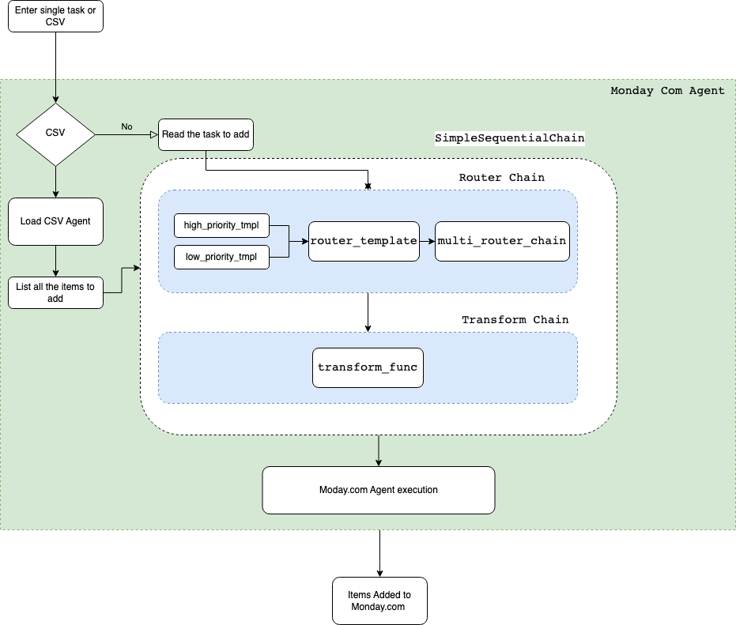

# TODO AI app with Langchain and monday.com

## Introduction

The TODO AI App is a potent task management solution that combines the project management elements of Monday.com with the natural language processing capabilities of Langchain. Using straightforward and understandable natural language instructions, this integration enables you to create and manage tasks.

## Getting Started
Follow these steps to get started with the TODO AI App:

### Prerequisites
* Python (3.6+)
* Homebrew
* Poetry
* A Monday.com account with API access. You'll need to create an API token in your Monday.com account settings.

### Installation
1. Clone the repository:

```bash
git clone https://github.com/yourusername/todo-ai-app.git
```

2. Change into the project directory:


```bash
cd langchain-sprint-project
```

3. Install dependencies using Poetry:

```bash
poetry install
```

4. Create a .env file in the project directory and add your Monday.com API token:

```makefile
OPENAI_API_KEY=your-api-token-here
MONDAY_API_TOKEN=your-api-token-here
```

### Usage
To run the TODO AI App, use the following command:

```bash
poetry run python main.py
```

Follow the on-screen instructions to start creating tasks using natural language.

### Architecture Diagram
